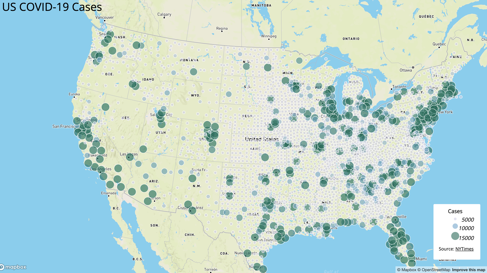
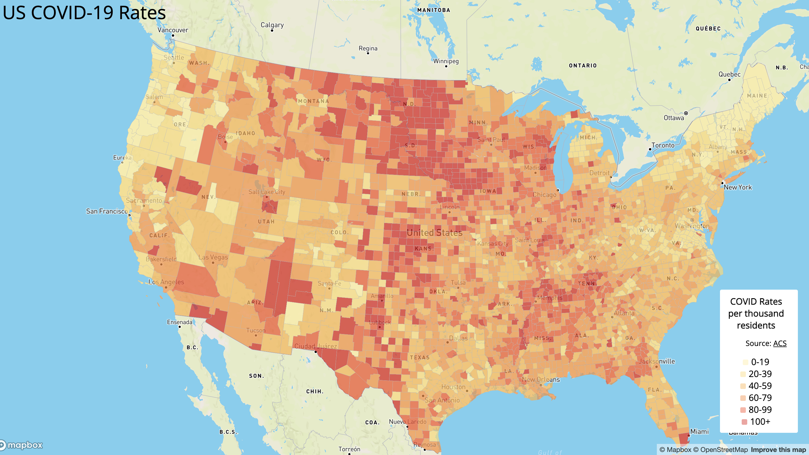

# COVID Mapping

## Overview

In this project, I mapped US COVID-19 data from 2020. This involved using HTML, CSS, Javascript, and the Mapbox library. For both maps, I first transformed the Shapefiles into GeoJSON files in order to visualize with Mapbox. Both maps use the Albers projection to better present US regions.

## Map 1

This proportional symbol map uses [New York Times](https://github.com/nytimes/covid-19-data/blob/43d32dde2f87bd4dafbb7d23f5d9e878124018b8/live/us-counties.csv) data. We can observe that the corner regions of the US are burdened with the most amount of COVID cases while the middle region seems to have fewer infections. Eastern regions also has more than western areas in general.

## Map 2

This choropleth map uses [ACS](https://data.census.gov/table?g=0100000US$050000&d=ACS+5-Year+Estimates+Data+Profiles&tid=ACSDP5Y2018.DP05&hidePreview=true) data. This map seems to tell the opposite story from the previous one. The middle regions have higher rates while the corner regions have fewer rates. To create this choropleth map, we "filled" the layers instead of drawing "circles".
